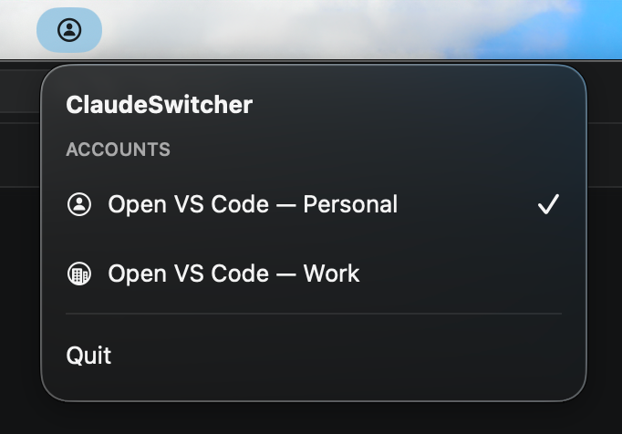

# ClaudeSwitcher

A lightweight macOS menu bar app that launches VS Code under one of two separate Claude Code accounts (personal / work) by injecting `CLAUDE_CONFIG_DIR` into the launched process. One click, no terminal.

| Personal account active | Work account active |
| :---: | :---: |
|  |  |

## Requirements

- macOS 26 (Tahoe) or later
- [Visual Studio Code](https://code.visualstudio.com) installed (stock build; VS Code Insiders / Cursor / VSCodium not supported in v1)
- [Claude Code CLI](https://code.claude.com/) — install with:
  ```
  curl -fsSL https://claude.ai/install.sh | bash
  ```

## Install

Both options install the same Developer ID-signed, Apple-notarized build — no Gatekeeper workaround required.

### Option 1 — Homebrew (recommended)

```sh
brew tap thepixelme/tap
brew install --cask claudeswitcher
```

Launch **ClaudeSwitcher** from Applications or Spotlight; the icon appears in the menu bar. Future versions update via `brew upgrade --cask claudeswitcher`.

### Option 2 — Download the DMG

1. Grab `ClaudeSwitcher-x.y.z.dmg` from [the Releases page](https://github.com/thepixelme/claudeswitcher/releases/latest).
2. Open the DMG and drag **ClaudeSwitcher.app** to **Applications**.
3. Launch **ClaudeSwitcher** from Applications. The icon appears in the menu bar.

Then continue to the first-run setup below.

## Initial setup (one time per account)

Open the menu bar popover. The first-run screen offers **Log In — Personal** and **Log In — Work** buttons. Each one opens a Terminal window running:

```
CLAUDE_CONFIG_DIR=~/.claude-personal claude
CLAUDE_CONFIG_DIR=~/.claude-work     claude
```

These commands stay visible above the buttons as a copy-paste fallback for iTerm, Ghostty, or any non-Terminal workflow. Complete the browser OAuth flow for each account, then exit the REPL.

The setup screen auto-advances to the main menu once both `~/.claude-*` directories exist (no "I've logged in" click required). If the two paths collide via symlink, an inline error surfaces and the main UI refuses to activate.

## Day-to-day usage

Click the menu bar icon and pick one of:

- **Open VS Code — Personal**
- **Open VS Code — Work**

If VS Code is already running under a different account, ClaudeSwitcher shows a "Quit & Relaunch" confirmation and relaunches it with the right environment. Same-account clicks within one ClaudeSwitcher session **do not** trigger the quit prompt — they just bring the existing window forward.

The menu bar icon reflects the **last-launched** account (`person.circle` for Personal, `building.2.crop.circle` for Work). If either config dir is missing, the icon swaps to `exclamationmark.triangle.fill` and the popover re-enters the setup flow.

## One-time macOS permission prompt

The first time you switch accounts, macOS shows:

> "ClaudeSwitcher" would like to control "Visual Studio Code"

Approve it. ClaudeSwitcher uses `NSRunningApplication.terminate()` to ask VS Code to quit — an Apple Event, hence the permission prompt. **Not malware.** The grant lives under *System Settings → Privacy & Security → Automation* if you ever need to revoke it. If you deny the prompt, the launcher surfaces `quitRequestFailed` with re-enable instructions.

## Known quirks

### Config-dir validation is shallow

ClaudeSwitcher only checks that `~/.claude-personal` and `~/.claude-work` exist *as directories*. An empty directory passes; a logged-out account surfaces its problem only when you actually try to use Claude inside VS Code.

### `claude` CLI on PATH inside VS Code

ClaudeSwitcher does **not** probe whether `claude` is on PATH — by design. If the Claude Code extension inside VS Code complains that `claude` is missing, re-run the install command from the setup screen, then quit and relaunch VS Code via ClaudeSwitcher so the new PATH is picked up.

### Hostile shell rc files

If `~/.zshrc` (or your `$SHELL`'s rc file) hangs — waits on stdin, hits a slow network probe — ClaudeSwitcher bounds the PATH lookup at 3 seconds and falls back to the launchd environment. VS Code still launches, but its integrated terminal may not see Homebrew / nvm / asdf paths. Look for a `ShellEnvironment: ...` line in Console.app if you suspect this.

## Building from source

For contributors, or if you'd rather build locally. Requires Xcode 26 or later.

1. Open `ios/ClaudeSwitcher.xcodeproj` in Xcode.
2. Select the `ClaudeSwitcher` scheme and press ⌘R.

The app appears in the menu bar (no Dock icon). All routine build settings (bundle ID, deployment target, `LSUIElement`, principal class, Apple Events usage string) are committed in the Xcode project — no manual configuration needed.

The two non-obvious settings worth knowing: **App Sandbox is disabled**, **Hardened Runtime is enabled**, and the entitlements file declares `com.apple.security.automation.apple-events` (required under Hardened Runtime for the VS Code quit/relaunch to work). Release builds are signed with Developer ID Application (team `<APPLE_TEAM_ID>`) and notarized via Xcode's *Distribute App → Direct Distribution* flow — see [RELEASING.md](RELEASING.md) for the full release process.

## What's NOT supported

- VS Code Insiders, Cursor, VSCodium (different bundle IDs)
- More than two accounts
- Switching accounts without quitting VS Code (not a limitation of this app — VS Code's environment is fixed at process start)
- Preferences window / auto-update / Mac App Store distribution
